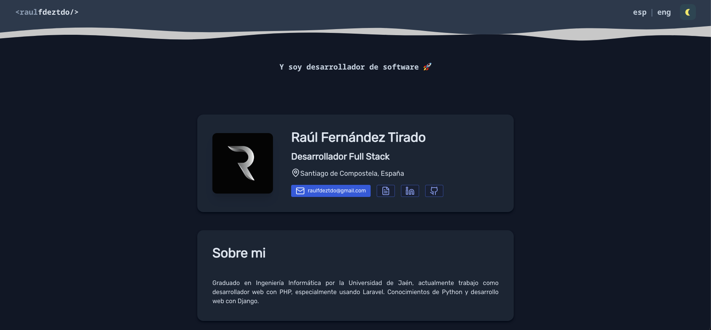
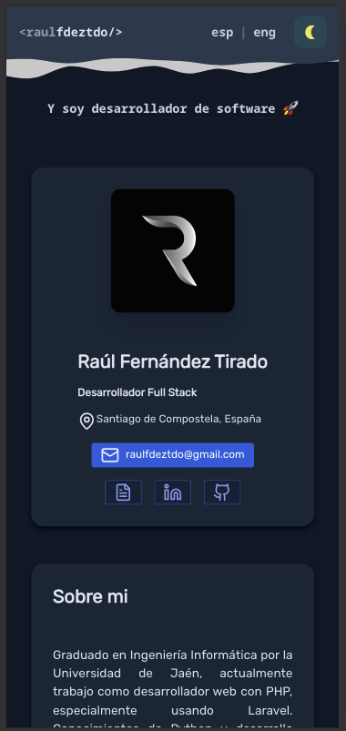
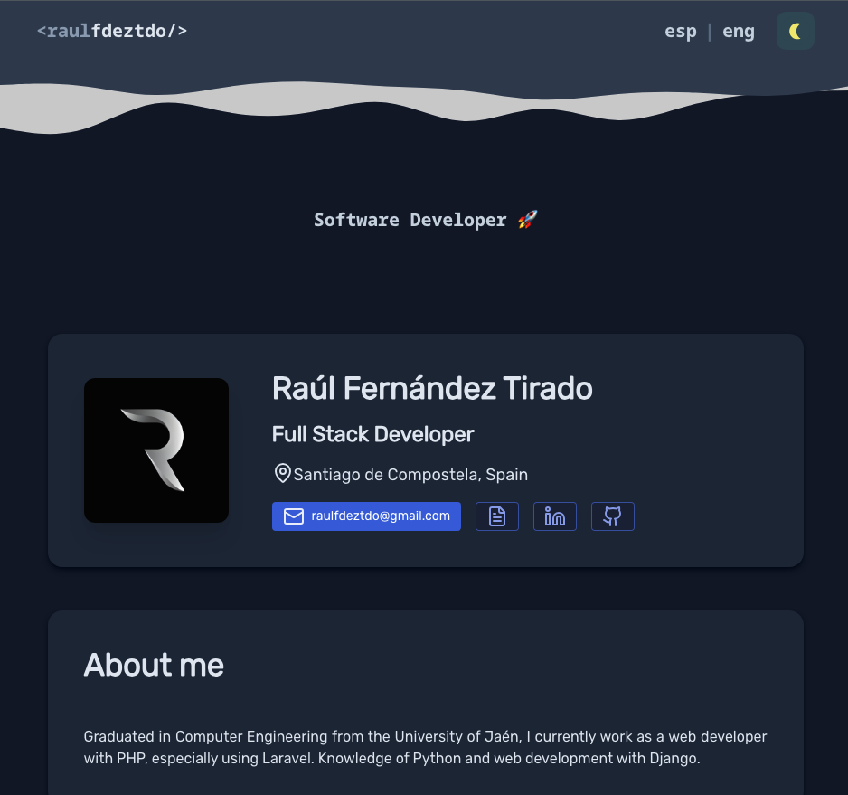

# 🚨 PROYECTO DEPRECADO

> **⚠️ Este proyecto está deprecado y ya no se mantiene activamente.**

## 🔗 Nueva Versión

**Visita la nueva versión del portafolio:**

🌐 **[raulfdez.dev](https://raulfdez.dev)**
📂 **[Nuevo Repositorio](https://github.com/raulfdeztdo/raulfdez.dev)**

## 🌐 Demo en Vivo

> **⚠️ ADVERTENCIA**: El demo en vivo presenta problemas con el modo oscuro/claro debido a incompatibilidades tras actualizar Reflex, Python y TailwindCSS. Al ser un proyecto deprecado, estos problemas no han sido corregidos.

🔗 **[Ver Demo - View Demo](https://portfoliorft.netlify.app/)**

---

# 💼 Portafolio Personal

[](https://python.org)
[](https://reflex.dev)
[](https://tailwindcss.com)
[](https://postcss.org)
[](https://typescriptlang.org)
[](LICENSE)

Antigua versión de mi portafolio personal moderno y responsivo desarrollado con **Reflex** (Python) y **TailwindCSS**. Incluye soporte multidioma (Español/Inglés) y modo oscuro/claro.

## 📸 Capturas de Pantalla

### 🖥️ Vista de Escritorio


### 📱 Vista Móvil


### 🌍 Versión en Inglés


## ✨ Características

- 🎨 **Diseño Moderno**: Interfaz limpia y profesional
- 📱 **Totalmente Responsivo**: Optimizado para todos los dispositivos
- 🌙 **Modo Oscuro/Claro**: Cambio dinámico de tema
- 🌍 **Multiidioma**: Soporte para Español e Inglés
- ⚡ **Alto Rendimiento**: Construido con Reflex para máxima velocidad
- 🎯 **SEO Optimizado**: Meta tags y estructura semántica
- 🔧 **Fácil Personalización**: Código modular y bien documentado

## 🛠️ Tecnologías Utilizadas

### Backend
- **Reflex 0.6.8** - Framework web moderno para Python
- **Python 3.13+** - Lenguaje de programación principal

### Frontend
- **TailwindCSS 3.4.3** - Framework CSS utilitario
- **PostCSS 8.4.38** - Procesador CSS
- **Autoprefixer 10.4.19** - Prefijos CSS automáticos
- **Typed.js 2.1.0** - Efectos de escritura animada
- **Devicon 2.16.0** - Iconos de tecnologías

### Herramientas de Desarrollo
- **Netlify** - Despliegue y hosting
- **Git** - Control de versiones

## 🚀 Instalación y Uso

### Prerrequisitos - Prerequisites
- Python 3.8 o superior
- Node.js y npm (para dependencias de frontend)

### Instalación

1. **Clonar el repositorio**
```bash
git clone https://github.com/tu-usuario/portafolio-personal.git
cd portafolio-personal
```

2. **Crear entorno virtual**
```bash
python -m venv venv
source venv/bin/activate  # En Windows: venv\Scripts\activate
```

3. **Instalar dependencias de Python**
```bash
pip install -r requirements.txt
```

4. **Instalar dependencias de Node.js**
```bash
npm install
```

5. **Compilar estilos**
```bash
npm run build
```

6. **Ejecutar en modo desarrollo**
```bash
reflex run
```

### 🏗️ Build para Producción

```bash
# Compilar estilos
npm run build

# Generar build de producción
reflex export --frontend-only

# O usar el script personalizado
./local_build.sh
```

## 📁 Estructura del Proyecto

```
portafolio-personal/
├── assets/                 # Recursos estáticos
│   ├── data/              # Datos del portafolio (ES/EN)
│   ├── fonts/             # Fuentes personalizadas
│   ├── images/            # Imágenes y recursos gráficos
│   └── styles/            # Archivos CSS
├── portafolio_personal/   # Código fuente principal
│   ├── components/        # Componentes reutilizables
│   ├── views/             # Vistas de la aplicación
│   ├── styles/            # Estilos de Python
│   └── i18n/              # Internacionalización
├── requirements.txt       # Dependencias de Python
├── package.json          # Dependencias de Node.js
└── rxconfig.py           # Configuración de Reflex
```

## 🎨 Personalización

### Modificar Datos Personales
Edita los archivos en `assets/data/`:
- `data_es.json` - Datos en español
- `data_en.json` - Datos en inglés

### Cambiar Estilos
- **Colores y tema**: `portafolio_personal/styles/styles.py`
- **CSS personalizado**: `assets/styles.css`
- **Configuración Tailwind**: `tailwind.config.js`

## 📄 Licencia

Este proyecto está bajo la Licencia MIT. Ver el archivo [LICENSE](LICENSE) para más detalles.

## 👨‍💻 Autor

**Raúl Fernández Tirado**
- 🌐 Website: [raulfdez.dev](https://raulfdez.dev)
- 📧 Email: raulfdeztdo@gmail.com
- 💼 LinkedIn: [Raúl Fernández Tirado](https://linkedin.com/in/raulfdeztdo)
- 🐙 GitHub: [@raulfdeztdo](https://github.com/raulfdeztdo)

---

<div align="center">

**⭐ Si te gusta este proyecto, ¡dale una estrella! ⭐**

**🔗 [Visita la nueva versión](https://raulfdez.dev)**

</div>
